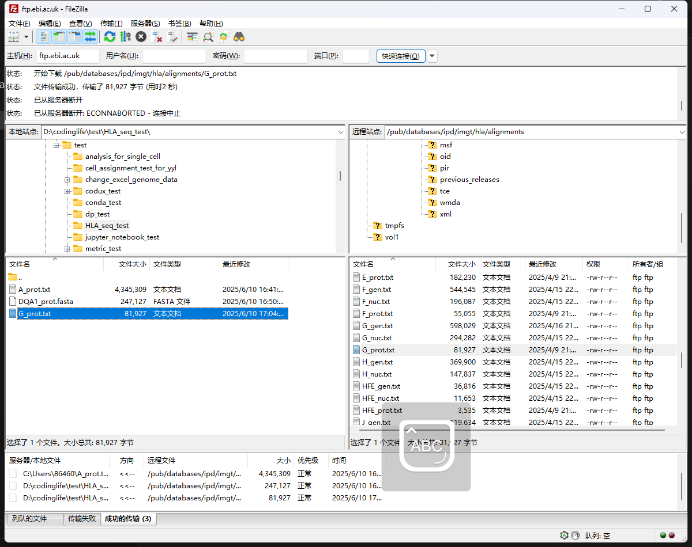
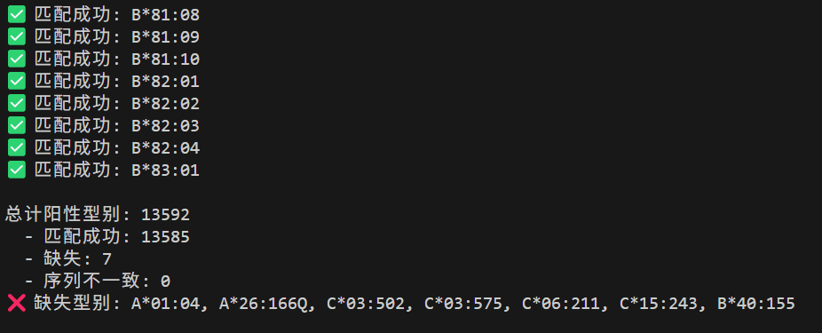
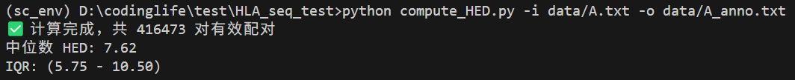
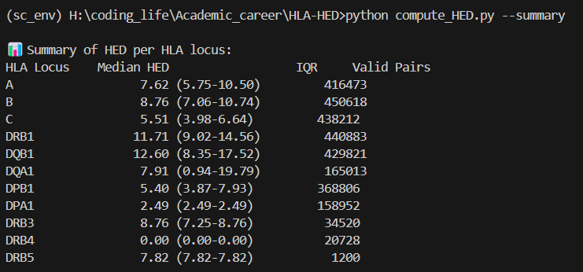
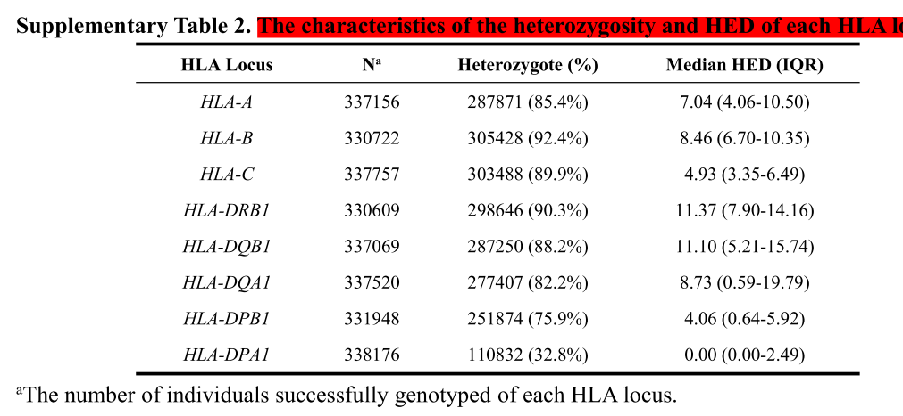

# 下载 HLA 各个型别氨基酸序列

https://www.ebi.ac.uk/ipd/imgt/hla/download/

使用 filezilla 进行下载：


氨基酸序列位置：/pub/databases/ipd/imgt/hla/fasta
完整氨基酸序列文件：/pub/databases/ipd/imgt/hla/hla_prot.fasta
HLA 基因功能注释文件：/pub/databases/ipd/imgt/hla/hla.dat
HED 参考仓库：https://github.com/sunhuaibo/HLA-HED

# 分析记录 20250612

## 文件说明

通过脚本[dat_parse_debug.py](./data/dat_parse_debug.py)得到到 HLA Class I 和 Class II 的 exon2/3 氨基酸序列： [hla_exon_sequences.fasta](./data/hla_exon_sequences.fasta)
文献 github 仓库的 HLA ABC 基因的 exon2/3 氨基酸序列：[ABC_prot.fa](./data/ABC_prot.fa)

## 分析说明

- 通过脚本[validate_results.py](./validate_results.py) 验证，我们找到的 ABC 三个基因的数量与文献提供的文件数量基本一致，不同的几个型别主要是结尾是 N 的类型以及结尾是 Q 的类型，我们在输出结果的时候过滤了结尾是 N 的型别，因为它们被认为不表达，而 Q 代表疑似编码蛋白功能异常（Questionable expression）。我发现**A\*26:166Q**在我下载的[hla.dat](./data/hla.dat)中是不带 Q 的，而在[ABC_prot.fa](./data/ABC_prot.fa)中是带 Q 的，我推测是版本更新的问题。
  验证结果截图如下所示：
  

- 我在计算 HED 的时候，发现每个基因的各个等位基因的长度不一致，长度统计请见[hla_seq_length_stats_by_gene.txt](./data/hla_seq_length_stats_by_gene.txt)

- 检查后发现，长度不一致的都是 Q 结尾的，也就是 questionable expression，而且它们都不在[ABC_prot.fa](./data/ABC_prot.fa)中，因此我推断，我们只需要保留和计算长度一致的基因序列的 HED 即可。

- 关于 HED 所代表的含义，以及为什么它要除以 2.2,ChatGPT 的检索结果如下：

这句话的意思是：**在用 Grantham 距离来衡量两个氨基酸序列之间的差异时，平均每 2.2 个 Gratham 单位的差异，相当于 1 个“有效”的氨基酸位点发生了改变**。这个换算是为了让最终的 HED（HLA Evolutionary Divergence）值更具生物学意义——它可以近似表示“等价有多少个位点发生了突变”。

---

##### 🔬 举个例子：

假设你有两个氨基酸序列长度相同（比如 HLA-A 的 exon2+3 拼接），它们的每个位点两两比对后，计算出的 Grantham 距离加起来为：

```
总 Grantham 距离 = 110
```

根据经验换算系数（2.2），你可以估算这两个序列之间的“有效氨基酸差异数”是：

```
有效差异位点 ≈ 110 / 2.2 ≈ 50
```

也就是说，虽然可能每个位点的差异程度不同（因为 Grantham 考虑了体积、电荷、极性等），**但总体来看，这两个序列之间的差异大致相当于 50 个位点发生了替换**。

---

##### 🧪 背后原因：

这个“2.2”不是数学推导出来的，而是来自于经验数据的拟合。例如在一些研究中（如 2018 年 Pierini & Lenz 或 2019 年 Chowell 等的研究），他们对不同序列之间的 Gratham 累积距离进行了对照分析，发现将 Gratham 总距离除以 2.2 后，更好地反映了“等效突变数量”与免疫学多样性的关系。

---

## 20250613

仔细检查了文献的脚本，文献的脚本的计算方法如下，和之前的代码最大的不同是它除以了序列的长度:

```python
def calculate_distange(hla1: str, hla2: str, sequences: dict, distance: dict) -> float:
    seq_hla1 = sequences.get(hla1, False)
    seq_hla2 = sequences.get(hla2, False)
    if not seq_hla1 or not seq_hla2:
        return("NA")
    else:
        seq_len = len(seq_hla1)
        dis = 0
        for i in range(seq_len):
            aa1 = seq_hla1[i]
            aa2 = seq_hla2[i]
            dis += distance[aa1][aa2]
        dis = dis / seq_len
        return dis
```

这也是我之前算的结果偏大的原因，修正之后我们现在可以通过[compute_HED.py](./compute_HED.py)进行计算，相关计算结果如下：



文献的结果如下所示

